# Calibre Modern GNOME

This is a Calibre icon theme, a modern and a clean one. All themes, that are currently available in Calibre icon store, are morally deprecated and should be replaced with some modern alternative. This is that alternative.

## Key Principles

1. Use modern Ubuntu GNOME icons as much as it is possible, particularly Yaru-Blue version. I really like GNOME iteration of Ununtu Linux in terms of UI and try to implement their icons in Calibre interface. If there is a good Ubuntu GNOME icon for a certain UI element in Calibre, it should be prioritised for implementation. Yaru-Blue is my choice because it feels more more fitting in Calibre interface than others, if we speak of what is available in Yaru.

2. If there is no Ununtu GNOME icon that fits, use suitable icons from other themes available in the Calibre icon store. Some of these themes have good icons for certain UI elements, while not conflicting with modern GNOME style. If there is no suitable GNOME icon, you should try to find one in other themes. The key requirement is to avoid style conflicts with Yaru-Blue.

3. Use any other suitable open-source icons that do not conflict stylistically with modern GNOME icons. Sometimes there is no good icon for certain UI element in either Yaru-Blue or Calibre icon themes. In that case you should try to find a good open-source (or free for non-commercial use) icon alternative.

## Icons Update Status and Source

The table below represents the current update status of each icon in the collection and its source. The icons are listed in alphabetical order. Status options:

1. "Updated": icon was successfully replaced;
2. "Needs an update": icon should be replaced with a modern alternative;
3. "Unable to update": icon is not replacable because it used for multiple, contradicting purposes in the Calibre UI. Such icons could be updated only after UI changes in the Calibre itself;
4. "Unchanged": icon do not need an update because it is good enough already.

| File name                      | Icon                                       | Source                                    | Status           |
|--------------------------------|--------------------------------------------|-------------------------------------------|------------------|
| add_book.png                   |                    | Ubuntu GNOME Yaru-Blue                    | Updated          |
| apple-touch-icon.png           |            | Pan4ratte (Me)                            | Updated          |
| arrow-down.png                 |                  | Calibre original icon                     | Unable to Update |
| arrow-up.png                   |                    | Calibre original icon                     | Unable to Update |
| auto_author_sort.png           |            | Calibre original icon                     | Needs an update  |
| auto-reload.png                |                 | Calibre original icon                     | Needs an update  |
| auto-scroll.png                |                 | Calibre original icon                     | Needs an update  |
| back.png                       |                        | Calibre original icon                     | Needs an update  |
| beautify.png                   |                    | Calibre original icon                     | Needs an update  |
| blank.png                      |                       | Calibre original icon                     | Unchanged        |
| book.png                       |                        | Calibre original icon                     | Updated          |
| bookmarks.svg                  |                   | Ubuntu GNOME Yaru-Blue                    | Updated          |
| books_in_series.svg            |             | Ubuntu GNOME Yaru-Blue                    | Updated          |
| bullhorn.png                   |                    | Calibre original icon                     | Needs an update  |
| catalog.png                    |                     | Calibre original icon                     | Needs an update  |
| chapters.png                   |                    | Calibre original icon                     | Needs an update  |
| character-set.png              |               | Ubuntu GNOME Yaru-Blue                    | Updated          |
| clear_left-for-dark-theme.png  |   | Calibre original icon                     | Needs an update  |
| clear_left-for-light-theme.png |  | Calibre original icon                     | Needs an update  |
| close-for-dark-theme.png       |        | Calibre original icon                     | Needs an update  |
| close-for-light-theme.png      |       | Calibre original icon                     | Needs an update  |
| code.png                       | 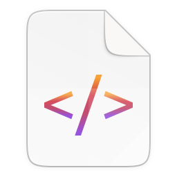                       | Ubuntu GNOME Yaru-Blue                    | Updated          |
| column.png                     | 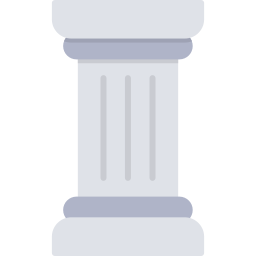                     | Icons8 (???)                              | Updated          |
| compress-image.png             |              | Calibre original icon                     | Needs an update  |
| config.png                     |                      | Ubuntu GNOME Yaru-Blue                    | Updated          |
| connect_share.png              | 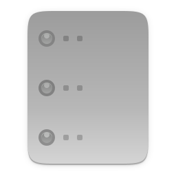              | Ubuntu GNOME Yaru-Blue (customized by me) | Updated          |
| connect_share_on.png           | 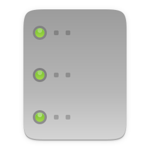           | Ubuntu GNOME Yaru-Blue                    | Updated          |
| context_menu.png               | 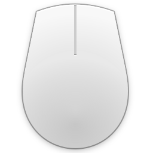               | Ubuntu GNOME Yaru-Blue                    | Updated          |
| convert.png                    |                     | Ubuntu GNOME Yaru-Blue                    | Updated          |
| copy-to-library.png            | 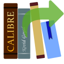            | Calibre original icon                     | Needs an update  |
| cover_flow.png                 |                  | Calibre original icon                     | Needs an update  |
| debug.svg                      |                       | ???                                       | Updated          |
| default_cover.png              |               | Calibre original icon                     | Needs an update  |
| dialog_error.png               |                | Ubuntu GNOME Yaru-Blue                    | Updated          |
| dialog_information.png         |          | Ubuntu GNOME Yaru-Blue                    | Updated          |
| dialog_question.png            |             | Ubuntu GNOME Yaru-Blue                    | Updated          |
| dialog_warning.png             |              | Ubuntu GNOME Yaru-Blue                    | Updated          |
| dictionary.png                 |                  | Ubuntu GNOME Yaru-Blue                    | Updated          |
| diff.png                       |                        | Calibre original icon                     | Needs an update  |
| document_open.png              |               | Ubuntu GNOME Yaru-Blue                    | Updated          |
| document-encrypt.png           |            | Ubuntu GNOME Yaru-Blue                    | Updated          |
| document-import.png            |             | Ubuntu GNOME Yaru-Blue                    | Updated          |
| document-new.png               |                | Ubuntu GNOME Yaru-Blue                    | Updated          |
| document-split.png             |              | Calibre original icon                     | Needs an update  |
| donate.svg                     |                      | ???                                       | Updated          |
| dot_green.svg                  |                   | ???                                       | Updated          |
| dot_red.svg                    |                     | ???                                       | Updated          |
| download-metadata.png          |           | Ubuntu GNOME Yaru-Blue                    | Updated          |
| drm-locked.svg                 |                  | ???                                       | Updated          |
| drm-unlocked.svg               |                | ???                                       | Updated          |
| edit-clear.png                 |                  | Calibre original icon                     | Needs an update  |
| edit-copy.png                  | 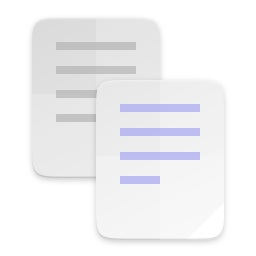                  | Ubuntu GNOME Yaru-Blue                    | Updated          |
| edit-cut.png                   | 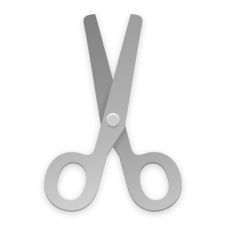                   | Ubuntu GNOME Yaru-Blue                    | Updated          |
| edit-paste.png                 | 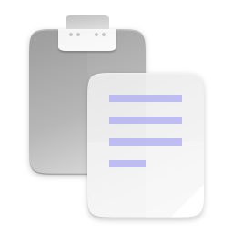                 | Ubuntu GNOME Yaru-Blue                    | Updated          |
| edit-redo.png                  |                   | Ubuntu GNOME Yaru-Blue                    | Updated          |
| edit-select-all.png            | 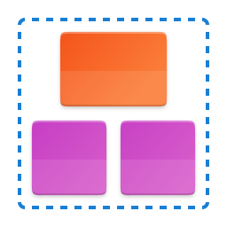            | Ubuntu GNOME Yaru-Blue                    | Updated          |
| edit-undo.png                  |                   | Ubuntu GNOME Yaru-Blue                    | Updated          |
| edit_book.png                  |                   | Ubuntu GNOME Yaru-Blue                    | Updated          |
| edit_input.png                 |                  | Ubuntu GNOME Yaru-Blue                    | Updated          |
| eject.png                      |                       | Ubuntu GNOME Yaru-Blue                    | Updated          |
| embed-fonts.png                |                 | Ubuntu GNOME Yaru-Blue                    | Updated          |
| exec.png                       |                        | Ubuntu GNOME Yaru-Blue                    | Updated          |
| external-link.png              |               | Ubuntu GNOME Yaru-Blue                    | Updated          |
| filter.png                     | 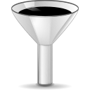                     | Calibre original icon                     | Needs an update  |
| folder_saved_search.png        |         | Ubuntu GNOME Yaru-Blue                    | Updated          |
| font.png                       |                        | Ubuntu GNOME Yaru-Blue                    | Updated          |
| font_size_larger.svg           |            | ???                                       | Updated          |
| font_size_smaller.svg          |           | ???                                       | Updated          |
| format-fill-color.svg          |           | ???                                       | Updated          |
| format-indent-less.png         |          | Ubuntu GNOME Yaru-Blue                    | Updated          |
| format-indent-more.png         |          | Ubuntu GNOME Yaru-Blue                    | Updated          |
| format-justify-center.png      |       | Ubuntu GNOME Yaru-Blue                    | Updated          |
| format-justify-fill.png        | 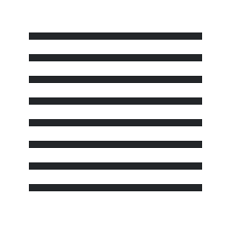        | Ubuntu GNOME Yaru-Blue                    | Updated          |
| format-justify-left.png        |         | Ubuntu GNOME Yaru-Blue                    | Updated          |
| format-justify-right.png       |        | Ubuntu GNOME Yaru-Blue                    | Updated          |
| format-list-ordered.png        |         | Ubuntu GNOME Yaru-Blue                    | Updated          |
| format-list-unordered.png      |       | Ubuntu GNOME Yaru-Blue                    | Updated          |
| format-text-bold.png           |            | Ubuntu GNOME Yaru-Blue                    | Updated          |
| format-text-color.png          |           | Ubuntu GNOME Yaru-Blue                    | Updated          |
| format-text-heading.png        |         | Calibre original icon                     | Needs an update  |
| format-text-hr.png             |              | Calibre original icon                     | Needs an update  |
| format-text-italic.png         | 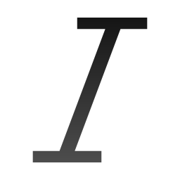         | Ubuntu GNOME Yaru-Blue                    | Updated          |
| format-text-strikethrough.png  |   | Ubuntu GNOME Yaru-Blue                    | Updated          |
| format-text-subscript.png      |       | Ubuntu GNOME Yaru-Blue                    | Updated          |
| format-text-superscript.png    |     | Ubuntu GNOME Yaru-Blue                    | Updated          |
| format-text-underline.png      |       | Ubuntu GNOME Yaru-Blue                    | Updated          |
| forward.png                    |                     | Calibre original icon                     | Needs an update  |
| fts.png                        |                         | Calibre original icon                     | Needs an update  |
| generic-library.png            |             | Calibre original icon                     | Needs an update  |
| gmail_logo.svg                 |                  | ???                                       | Unchanged        |
| grid.png                       |                        | Calibre original icon                     | Needs an update  |
| h-ellipsis.png                 |                  | Ubuntu GNOME Yaru-Blue                    | Updated          |
| help.png                       |                        | Ubuntu GNOME Yaru-Blue                    | Updated          |
| heuristics.png                 |                  | Calibre original icon                     | Needs an update  |
| highlight.png                  |                   | Calibre original icon                     | Needs an update  |
| highlight_only_off.png         |          | Calibre original icon                     | Needs an update  |
| highlight_only_on.png          |           | Calibre original icon                     | Needs an update  |
| hotmail.svg                    |                     | ???                                       | Unchanged        |
| html-fix.png                   |                    | Calibre original icon                     | Needs an update  |
| icon_choose.png                |                 | Calibre original icon                     | Needs an update  |
| identifiers.png                |                 | Calibre original icon                     | Needs an update  |
| insert-link.png                |                 | Ubuntu GNOME Yaru-Blue                    | Updated          |
| jobs.png                       |                        | Calibre original icon                     | Needs an update  |
| keyboard-prefs.png             | 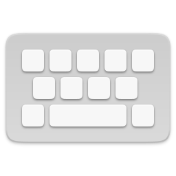             | Ubuntu GNOME Yaru-Blue                    | Updated          |
| languages.png                  |                   | Ubuntu GNOME Yaru-Blue                    | Updated          |
| layout.png                     | 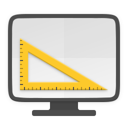                     | Calibre original icon                     | Needs an update  |
| library.png                    |                     | Ubuntu GNOME Yaru-Blue                    | Updated          |
| list_remove.png                |                 | Ubuntu GNOME Yaru-Blue                    | Updated          |
| lookfeel.png                   |                    | Calibre original icon                     | Needs an update  |
| lt.png                         | 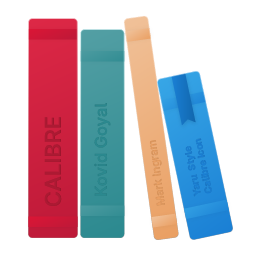                         | ???                                       | Unchanged        |
| mail.png                       |                        | Ubuntu GNOME Yaru-Blue                    | Updated          |
| marked.png                     |                      | Calibre original icon                     | Needs an update  |
| merge.png                      |                       | Calibre original icon                     | Needs an update  |
| merge_books.png                |                 | Calibre original icon                     | Needs an update  |
| metadata.png                   |                    | Ubuntu GNOME Yaru-Blue                    | Updated          |
| minus.svg                      |                       | Calibre original icon                     | Needs an update  |
| minusminus.png                 |                  | Calibre original icon                     | Needs an update  |
| modified-for-dark-theme.png    |     | Calibre original icon                     | Needs an update  |
| modified-for-light-theme.png   |    | Calibre original icon                     | Needs an update  |
| network-server.png             |              | Ubuntu GNOME Yaru-Blue                    | Updated          |
| news.png                       |                        | Calibre original icon                     | Needs an update  |
| next.svg                       |                        | Calibre original icon                     | Needs an update  |
| notes-for-dark-theme.png       |        | Calibre original icon                     | Needs an update  |
| notes.png                      | 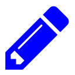                      | Ubuntu GNOME Yaru-Blue                    | Updated          |
| ok.svg                         |                          | Calibre original icon                     | Needs an update  |
| page.svg                       |                        | Calibre original icon                     | Needs an update  |
| plugboard.png                  |                   | Calibre original icon                     | Needs an update  |
| plugins.png                    |                     | Ubuntu GNOME Yaru-Blue                    | Updated          |
| plus.svg                       |                        | Calibre original icon                     | Needs an update  |
| plusplus.png                   |                    | Calibre original icon                     | Needs an update  |
| polish.png                     |                      | Calibre original icon                     | Needs an update  |
| previous.svg                   |                    | Calibre original icon                     | Needs an update  |
| print-preview.png              | 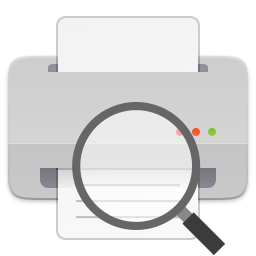              | Ubuntu GNOME Yaru-Blue                    | Updated          |
| print.png                      |                       | Ubuntu GNOME Yaru-Blue                    | Updated          |
| publisher.svg                  |                   | Calibre original icon                     | Needs an update  |
| quickview.png                  |                   | Calibre original icon                     | Needs an update  |
| random.png                     |                      | Calibre original icon                     | Needs an update  |
| rating.png                     |                      | Ubuntu GNOME Yaru-Blue                    | Updated          |
| reader.png                     |                      | Calibre original icon                     | Needs an update  |
| reference.png                  |                   | Calibre original icon                     | Needs an update  |
| remove_books.png               | 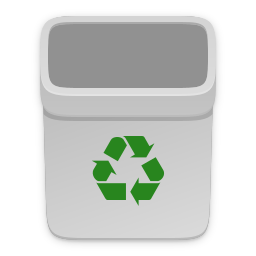               | Ubuntu GNOME Yaru-Blue                    | Updated          |
| reports.png                    | 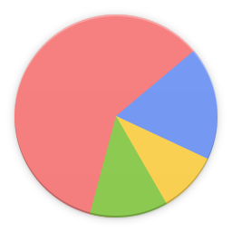                    | Calibre original icon                     | Needs an update  |
| resize.png                     |                      | Calibre original icon                     | Needs an update  |
| restart.png                    |                     | Ubuntu GNOME Yaru-Blue                    | Updated          |
| rotate-right.png               |                | Ubuntu GNOME Yaru-Blue                    | Updated          |
| save.png                       |                        | Ubuntu GNOME Yaru-Blue                    | Updated          |
| scheduler.png                  | 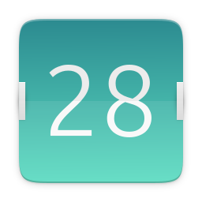                  | Calibre original icon                     | Needs an update  |
| scroll.png                     |                      | Calibre original icon                     | Needs an update  |
| sd.png                         | 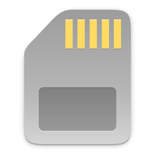                         | Calibre original icon                     | Needs an update  |
| search.png                     |                      | Ubuntu GNOME Yaru-Blue                    | Updated          |
| search_add_saved.png           |            | Calibre original icon                     | Needs an update  |
| search_copy_saved.png          |           | Calibre original icon                     | Needs an update  |
| search_delete_saved.png        |         | Calibre original icon                     | Needs an update  |
| series.svg                     |                      | Calibre original icon                     | Needs an update  |
| similar.png                    |                     | Calibre original icon                     | Needs an update  |
| smarten-punctuation.png        |         | Calibre original icon                     | Needs an update  |
| snippets.png                   |                    | Calibre original icon                     | Needs an update  |
| sort.png                       |                        | Calibre original icon                     | Needs an update  |
| spell-check.png                |                 | Ubuntu GNOME Yaru-Blue                    | Updated          |
| split.png                      |                       | Calibre original icon                     | Needs an update  |
| store.png                      |                       | Calibre original icon                     | Needs an update  |
| subset-fonts.png               |                | Calibre original icon                     | Needs an update  |
| swap.png                       |                        | Calibre original icon                     | Needs an update  |
| sync-right.png                 |                  | Calibre original icon                     | Needs an update  |
| sync.png                       | 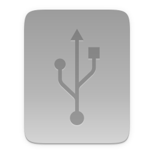                       | Ubuntu GNOME Yaru-Blue                    | Updated          |
| tags.png                       |                        | Ubuntu GNOME Yaru-Blue                    | Updated          |
| tb_folder.png                  |                   | Ubuntu GNOME Yaru-Blue                    | Updated          |
| template_funcs.png             |              | Calibre original icon                     | Needs an update  |
| toc.png                        |                         | Calibre original icon                     | Needs an update  |
| trash.png                      |                       | Ubuntu GNOME Yaru-Blue                    | Updated          |
| trim.png                       | 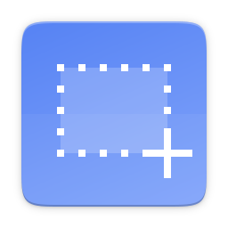                       | Calibre original icon                     | Needs an update  |
| tweak.png                      |                       | Calibre original icon                     | Needs an update  |
| tweaks.png                     |                      | Calibre original icon                     | Needs an update  |
| unpack-book.png                |                 | Calibre original icon                     | Needs an update  |
| user_profile.png               |                | Ubuntu GNOME Yaru-Blue                    | Updated          |
| v-ellipsis.png                 |                  | Ubuntu GNOME Yaru-Blue                    | Updated          |
| view-image.png                 |                  | Ubuntu GNOME Yaru-Blue                    | Updated          |
| view-refresh.png               |                | Ubuntu GNOME Yaru-Blue                    | Updated          |
| view.png                       |                        | Ubuntu GNOME Yaru-Blue                    | Updated          |
| viewer.png                     |                      | Calibre original icon                     | Needs an update  |
| vl.png                         |                          | Calibre original icon                     | Needs an update  |
| width.png                      |                       | Calibre original icon                     | Needs an update  |
| window-close.png               |                | Ubuntu GNOME Yaru-Blue                    | Updated          |
| wizard.png                     |                      | Calibre original icon                     | Needs an update  |