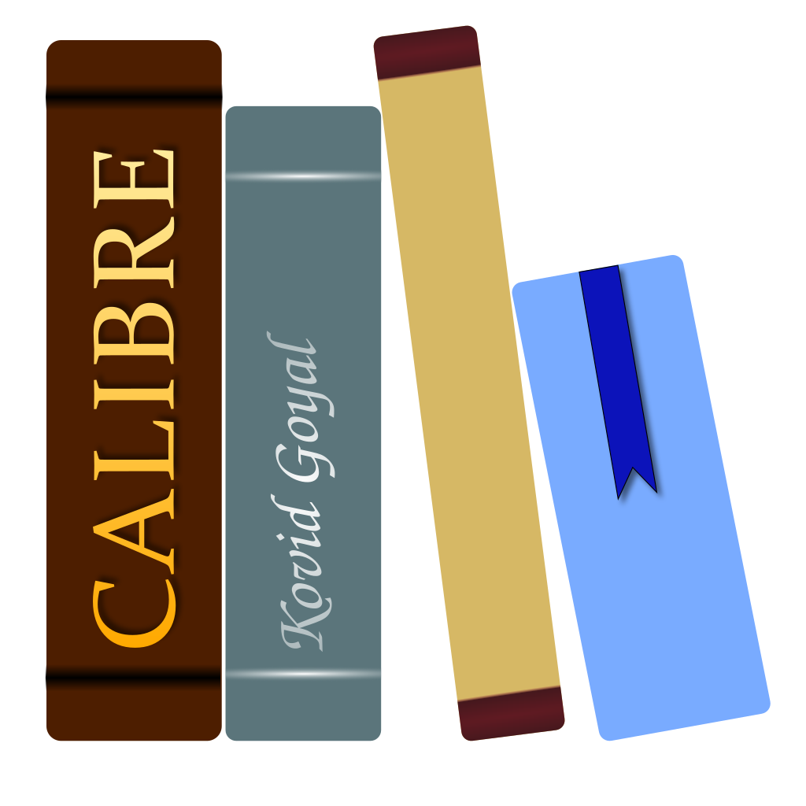

# Calibre Modern GNOME

This is a Calibre icon theme, a modern and a clean one. All themes, that are currently available in the Calibre icon store, are morally deprecated and should be replaced with some modern alternative. This is that alternative. See [CHANGELOG.md](CHANGELOG.md) for the changes in each release.

## Installation

The theme is not in calibre's icon theme list yet, so for now it is installed by hand:

1. Download this repository (Code → Download ZIP) and unpack it.
2. In calibre, open Preferences → Advanced → Miscellaneous → Open calibre configuration directory.
3. Copy the `images` folder from the download into the `resources` folder there (create `resources` if it does not exist).
4. Restart calibre.

Icons in that folder are used instead of any icon theme chosen in calibre. To go back to the default icons, delete `resources/images` and restart calibre.

## Development

This repository is meant to be cloned as calibre's `resources` folder, so calibre uses the icons in `images/` directly. Icons drawn for this project follow the [Yaru style guide](docs/yaru-style.md). `tools\theme.cmd` runs calibre's own icon theme tools on them (it needs calibre installed):

- `tools\theme.cmd check` lists calibre icons the theme does not have, icons calibre no longer uses, broken images and README tables that do not match the `images` folder.
- `tools\theme.cmd render` turns the icons drawn for this project, kept as SVG files in `src/`, into the 256×256 PNG files in `images/` that calibre uses. Edit the SVG, never the PNG.
- `tools\theme.cmd preview` closes calibre, builds the theme, installs it in calibre and starts calibre again, so you see exactly what a release would look like. Close calibre jobs first, the restart stops them.
- `tools\theme.cmd build` saves the theme as a calibre icon theme `.zip` in `dist/`, named after the newest version in [CHANGELOG.md](CHANGELOG.md). This is the file to send for inclusion in calibre's icon theme list.

## Key Principles

1. Use Ubuntu GNOME Yaru icons, particularly the Yaru-Blue version. I really like the GNOME iteration of Ubuntu Linux in terms of UI, and Yaru-Blue feels the most fitting in the calibre interface. If Yaru has a good icon for a certain UI element in calibre, use it.

2. If Yaru has no icon that fits, draw a new one in Yaru style. A Yaru icon with a similar meaning, changed or combined with other Yaru elements, is a good starting point.

3. No icons from other themes, websites or icon packs. Every icon in the theme is either a Yaru icon or drawn for this project, so the whole theme has one style and one license.

The goal is to replace every calibre icon this way. Icons that still come from other sources, including calibre's original icons, are listed under "Needs an update" until they are replaced.

## License

The theme is licensed under the [Creative Commons Attribution-ShareAlike 4.0 International License](LICENSE) (CC BY-SA 4.0), the same license as the Yaru icons it is based on.

- Yaru icons are made by the [Yaru team](https://github.com/ubuntu/yaru) and licensed under CC BY-SA 4.0. Customized Yaru icons are shared under the same license.
- Icons drawn for this project are licensed under CC BY-SA 4.0.
- Icons that are not replaced yet (the "Needs an update", "Unable to update" and "Unchanged" tables) keep their original licenses. Most of them are calibre's original icons, which come with calibre under its own licenses. Icons with an unknown source ("???") will be replaced first.

## Icons Update Status and Source

The tables below represent the current update status of each icon in the collection and its source. There is one table per status, and the icons in each table are listed in alphabetical order. Status options:

1. "Updated": icon was replaced with a Yaru icon or an icon drawn in Yaru style;
2. "Needs an update": icon should be replaced with a Yaru icon or an icon drawn in Yaru style;
3. "Unable to update": icon is not replacable because it used for multiple, contradicting purposes in the Calibre UI. Such icons could be updated only after UI changes in the Calibre itself;
4. "Unchanged": icon do not need an update because it is good enough already.

### Updated

| File name                      | Icon                                       | Source                                    |
|--------------------------------|--------------------------------------------|-------------------------------------------|
| add_book.png                   |                    | Ubuntu GNOME Yaru-Blue                    |
| apple-touch-icon.png           |            | Pan4ratte (Me)                            |
| arrow-down-for-dark-theme.png  |   | Pan4ratte (Me)                            |
| arrow-down.png                 |                  | Pan4ratte (Me)                            |
| arrow-up-for-dark-theme.png    |     | Pan4ratte (Me)                            |
| arrow-up.png                   |                    | Pan4ratte (Me)                            |
| auto-reload-for-dark-theme.png |  | Pan4ratte (Me)                            |
| auto-reload.png                |                 | Pan4ratte (Me)                            |
| auto-scroll-for-dark-theme.png |  | Pan4ratte (Me)                            |
| auto-scroll.png                |                 | Pan4ratte (Me)                            |
| auto_author_sort-for-dark-theme.png |  | Pan4ratte (Me)                            |
| auto_author_sort.png           |            | Pan4ratte (Me)                            |
| back-for-dark-theme.png        |         | Pan4ratte (Me)                            |
| back.png                       |                        | Pan4ratte (Me)                            |
| books_in_series.png            |             | Pan4ratte (Me)                            |
| bullhorn-for-dark-theme.png    |     | Pan4ratte (Me)                            |
| bullhorn.png                   |                    | Pan4ratte (Me)                            |
| chapters-for-dark-theme.png    |     | Pan4ratte (Me)                            |
| chapters.png                   |                    | Pan4ratte (Me)                            |
| character-set.png              |               | Ubuntu GNOME Yaru-Blue                    |
| clear_left-for-dark-theme.png  |   | Pan4ratte (Me)                            |
| clear_left-for-light-theme.png |  | Pan4ratte (Me)                            |
| close-for-dark-theme.png       |        | Pan4ratte (Me)                            |
| close-for-light-theme.png      |       | Pan4ratte (Me)                            |
| code.png                       |                        | Ubuntu GNOME Yaru-Blue                    |
| column.png                     |                      | Pan4ratte (Me)                            |
| config.png                     |                      | Ubuntu GNOME Yaru-Blue                    |
| connect_share.png              |               | Ubuntu GNOME Yaru-Blue (customized by me) |
| connect_share_on.png           |            | Ubuntu GNOME Yaru-Blue                    |
| context_menu.png               |                | Ubuntu GNOME Yaru-Blue                    |
| convert.png                    |                     | Ubuntu GNOME Yaru-Blue                    |
| dialog_error.png               |                | Ubuntu GNOME Yaru-Blue                    |
| dialog_information.png         |          | Ubuntu GNOME Yaru-Blue                    |
| dialog_question.png            |             | Ubuntu GNOME Yaru-Blue                    |
| dialog_warning.png             |              | Ubuntu GNOME Yaru-Blue                    |
| dictionary.png                 |                  | Ubuntu GNOME Yaru-Blue                    |
| diff-for-dark-theme.png        |         | Pan4ratte (Me)                            |
| diff.png                       |                        | Pan4ratte (Me)                            |
| document-encrypt.png           |            | Ubuntu GNOME Yaru-Blue                    |
| document-import.png            |             | Ubuntu GNOME Yaru-Blue                    |
| document-new.png               |                | Ubuntu GNOME Yaru-Blue                    |
| document-split-for-dark-theme.png |  | Pan4ratte (Me)                            |
| document-split.png             |              | Pan4ratte (Me)                            |
| document_open.png              |               | Ubuntu GNOME Yaru-Blue                    |
| download-metadata.png          |           | Ubuntu GNOME Yaru-Blue                    |
| edit-clear-for-dark-theme.png  |   | Pan4ratte (Me)                            |
| edit-clear.png                 |                  | Pan4ratte (Me)                            |
| edit-copy.png                  |                   | Ubuntu GNOME Yaru-Blue                    |
| edit-cut.png                   |                    | Ubuntu GNOME Yaru-Blue                    |
| edit-paste.png                 |                  | Ubuntu GNOME Yaru-Blue                    |
| edit-redo.png                  |                   | Ubuntu GNOME Yaru-Blue                    |
| edit-select-all.png            |             | Ubuntu GNOME Yaru-Blue                    |
| edit-undo.png                  |                   | Ubuntu GNOME Yaru-Blue                    |
| edit_book.png                  |                   | Ubuntu GNOME Yaru-Blue                    |
| edit_input.png                 |                  | Ubuntu GNOME Yaru-Blue                    |
| eject.png                      |                       | Ubuntu GNOME Yaru-Blue                    |
| embed-fonts.png                |                 | Ubuntu GNOME Yaru-Blue                    |
| exec.png                       |                        | Ubuntu GNOME Yaru-Blue                    |
| external-link.png              |               | Ubuntu GNOME Yaru-Blue                    |
| folder_saved_search.png        |         | Ubuntu GNOME Yaru-Blue                    |
| font.png                       |                        | Ubuntu GNOME Yaru-Blue                    |
| font_size_larger-for-dark-theme.png |  | Pan4ratte (Me)                            |
| font_size_larger.png           |            | Pan4ratte (Me)                            |
| font_size_smaller-for-dark-theme.png |  | Pan4ratte (Me)                            |
| font_size_smaller.png          |           | Pan4ratte (Me)                            |
| format-fill-color-for-dark-theme.png |  | Pan4ratte (Me)                            |
| format-fill-color.png          |           | Pan4ratte (Me)                            |
| format-indent-less.png         |          | Ubuntu GNOME Yaru-Blue                    |
| format-indent-more.png         |          | Ubuntu GNOME Yaru-Blue                    |
| format-justify-center.png      |       | Ubuntu GNOME Yaru-Blue                    |
| format-justify-fill.png        |         | Ubuntu GNOME Yaru-Blue                    |
| format-justify-left.png        |         | Ubuntu GNOME Yaru-Blue                    |
| format-justify-right.png       |        | Ubuntu GNOME Yaru-Blue                    |
| format-list-ordered-for-dark-theme.png |  | Pan4ratte (Me)                            |
| format-list-ordered.png        |         | Pan4ratte (Me)                            |
| format-list-unordered-for-dark-theme.png |  | Pan4ratte (Me)                            |
| format-list-unordered.png      |       | Pan4ratte (Me)                            |
| format-text-bold-for-dark-theme.png |  | Ubuntu GNOME Yaru-Blue (customized by me) |
| format-text-bold.png           |            | Ubuntu GNOME Yaru-Blue                    |
| format-text-color-for-dark-theme.png |  | Pan4ratte (Me)                            |
| format-text-color.png          |           | Pan4ratte (Me)                            |
| format-text-heading-for-dark-theme.png |  | Pan4ratte (Me)                            |
| format-text-heading.png        |         | Pan4ratte (Me)                            |
| format-text-hr-for-dark-theme.png |  | Pan4ratte (Me)                            |
| format-text-hr.png             |              | Pan4ratte (Me)                            |
| format-text-italic-for-dark-theme.png |  | Ubuntu GNOME Yaru-Blue (customized by me) |
| format-text-italic.png         |          | Ubuntu GNOME Yaru-Blue                    |
| format-text-strikethrough-for-dark-theme.png |  | Ubuntu GNOME Yaru-Blue (customized by me) |
| format-text-strikethrough.png  |   | Ubuntu GNOME Yaru-Blue                    |
| format-text-subscript-for-dark-theme.png |  | Pan4ratte (Me)                            |
| format-text-subscript.png      |       | Pan4ratte (Me)                            |
| format-text-superscript-for-dark-theme.png |  | Pan4ratte (Me)                            |
| format-text-superscript.png    |     | Pan4ratte (Me)                            |
| format-text-underline-for-dark-theme.png |  | Ubuntu GNOME Yaru-Blue (customized by me) |
| format-text-underline.png      |       | Ubuntu GNOME Yaru-Blue                    |
| forward-for-dark-theme.png     |      | Pan4ratte (Me)                            |
| forward.png                    |                     | Pan4ratte (Me)                            |
| grid.png                       |                        | Ubuntu GNOME Yaru-Blue                    |
| h-ellipsis.png                 |                  | Ubuntu GNOME Yaru-Blue                    |
| help.png                       |                        | Ubuntu GNOME Yaru-Blue                    |
| icon_choose.png                |                 | Ubuntu GNOME Yaru-Blue                    |
| identifiers.png                |                 | Pan4ratte (Me)                            |
| insert-link-for-dark-theme.png |  | Pan4ratte (Me)                            |
| insert-link.png                |                 | Pan4ratte (Me)                            |
| keyboard-prefs.png             |              | Ubuntu GNOME Yaru-Blue                    |
| languages.png                  |                   | Ubuntu GNOME Yaru-Blue                    |
| layout.png                     |                      | Ubuntu GNOME Yaru-Blue                    |
| library.png                    |                     | Pan4ratte (Me)                            |
| list_remove-for-dark-theme.png |  | Pan4ratte (Me)                            |
| list_remove.png                |                 | Pan4ratte (Me)                            |
| lookfeel.png                   |                    | Ubuntu GNOME Yaru-Blue                    |
| lt.png                         |                          | Pan4ratte (Me)                            |
| mail.png                       |                        | Ubuntu GNOME Yaru-Blue                    |
| minus-for-dark-theme.png       |        | Pan4ratte (Me)                            |
| minus.png                      |                       | Pan4ratte (Me)                            |
| minusminus-for-dark-theme.png  |   | Pan4ratte (Me)                            |
| minusminus.png                 |                  | Pan4ratte (Me)                            |
| network-server.png             |              | Ubuntu GNOME Yaru-Blue                    |
| news.png                       |                        | Ubuntu GNOME Yaru-Blue                    |
| next-for-dark-theme.png        |         | Pan4ratte (Me)                            |
| next.png                       |                        | Pan4ratte (Me)                            |
| ok-for-dark-theme.png          |           | Pan4ratte (Me)                            |
| ok.png                         |                          | Pan4ratte (Me)                            |
| plugboard.png                  |                   | Ubuntu GNOME Yaru-Blue                    |
| plugins.png                    |                     | Ubuntu GNOME Yaru-Blue                    |
| plus-for-dark-theme.png        |         | Pan4ratte (Me)                            |
| plus.png                       |                        | Pan4ratte (Me)                            |
| plusplus-for-dark-theme.png    |     | Pan4ratte (Me)                            |
| plusplus.png                   |                    | Pan4ratte (Me)                            |
| previous-for-dark-theme.png    |     | Pan4ratte (Me)                            |
| previous.png                   |                    | Pan4ratte (Me)                            |
| print-preview.png              |               | Ubuntu GNOME Yaru-Blue                    |
| print.png                      |                       | Ubuntu GNOME Yaru-Blue                    |
| publisher.png                  |                   | Pan4ratte (Me)                            |
| reader.png                     |                      | Ubuntu GNOME Yaru-Blue                    |
| remove_books.png               |                | Ubuntu GNOME Yaru-Blue                    |
| reports.png                    |                     | Ubuntu GNOME Yaru-Blue                    |
| restart.png                    |                     | Ubuntu GNOME Yaru-Blue                    |
| rotate-right-for-dark-theme.png |  | Pan4ratte (Me)                            |
| rotate-right.png               |                | Pan4ratte (Me)                            |
| save.png                       |                        | Ubuntu GNOME Yaru-Blue                    |
| scheduler.png                  |                   | Ubuntu GNOME Yaru-Blue                    |
| sd.png                         |                          | Ubuntu GNOME Yaru-Blue                    |
| search.png                     |                      | Ubuntu GNOME Yaru-Blue                    |
| search_add_saved.png           |            | Ubuntu GNOME Yaru-Blue                    |
| search_delete_saved.png        |         | Ubuntu GNOME Yaru-Blue                    |
| series.png                     |                      | Pan4ratte (Me)                            |
| store.png                      |                       | Ubuntu GNOME Yaru-Blue                    |
| sync-right-for-dark-theme.png  |   | Pan4ratte (Me)                            |
| sync-right.png                 |                  | Pan4ratte (Me)                            |
| sync.png                       |                        | Ubuntu GNOME Yaru-Blue                    |
| tags.png                       |                        | Pan4ratte (Me)                            |
| tb_folder.png                  |                   | Ubuntu GNOME Yaru-Blue                    |
| template_funcs.png             |              | Ubuntu GNOME Yaru-Blue                    |
| trash.png                      |                       | Ubuntu GNOME Yaru-Blue                    |
| trim.png                       |                        | Ubuntu GNOME Yaru-Blue                    |
| tweak.png                      |                       | Ubuntu GNOME Yaru-Blue                    |
| tweaks.png                     |                      | Ubuntu GNOME Yaru-Blue                    |
| user_profile.png               |                | Ubuntu GNOME Yaru-Blue                    |
| v-ellipsis.png                 |                  | Ubuntu GNOME Yaru-Blue                    |
| view-image.png                 |                  | Ubuntu GNOME Yaru-Blue                    |
| view-refresh-for-dark-theme.png |  | Pan4ratte (Me)                            |
| view-refresh.png               |                | Pan4ratte (Me)                            |
| view.png                       |                        | Ubuntu GNOME Yaru-Blue                    |
| viewer.png                     |                      | Ubuntu GNOME Yaru-Blue                    |
| window-close.png               |                | Ubuntu GNOME Yaru-Blue                    |
| wizard.png                     |                      | Ubuntu GNOME Yaru-Blue                    |

### Needs an update

| File name                      | Icon                                       | Source                                    |
|--------------------------------|--------------------------------------------|-------------------------------------------|
| ai.png                         |                          | Calibre original icon                     |
| beautify.png                   |                    | Calibre original icon                     |
| book.png                       |                        | Calibre original icon                     |
| bookmarks.svg                  |                   | Ubuntu GNOME Yaru-Blue                    |
| bookshelf.png                  |                   | Calibre original icon                     |
| calibre.svg                    |                     | Calibre original icon                     |
| catalog.png                    |                     | Calibre original icon                     |
| compress-image.png             |              | Calibre original icon                     |
| copy-to-library.png            |             | Calibre original icon                     |
| cover_flow.png                 |                  | Calibre original icon                     |
| cyoa.png                       |                        | Calibre original icon                     |
| debug.svg                      |                       | ???                                       |
| default_cover.png              |               | Calibre original icon                     |
| donate.svg                     |                      | ???                                       |
| dot_green.svg                  |                   | ???                                       |
| dot_red.svg                    |                     | ???                                       |
| drm-locked.svg                 |                  | ???                                       |
| drm-unlocked.svg               |                | ???                                       |
| favicon-192.png                |                 | Calibre original icon                     |
| favicon-512.png                |                 | Calibre original icon                     |
| filter.png                     |                      | Calibre original icon                     |
| fts.png                        |                         | Calibre original icon                     |
| gear.png                       |                        | Calibre original icon                     |
| generic-library.png            |             | Calibre original icon                     |
| gmail_logo.svg                 |                  | ???                                       |
| heuristics.png                 |                  | Calibre original icon                     |
| highlight.png                  |                   | Calibre original icon                     |
| highlight_only_off.png         |          | Calibre original icon                     |
| highlight_only_on.png          |           | Calibre original icon                     |
| hotmail.svg                    |                     | ???                                       |
| html-fix.png                   |                    | Calibre original icon                     |
| jobs.png                       |                        | Calibre original icon                     |
| marked.png                     |                      | Calibre original icon                     |
| merge.png                      |                       | Calibre original icon                     |
| merge_books.png                |                 | Calibre original icon                     |
| metadata.png                   |                    | Calibre original icon                     |
| modified-for-dark-theme.png    |     | Calibre original icon                     |
| modified-for-light-theme.png   |    | Calibre original icon                     |
| notes-for-dark-theme.png       |        | Calibre original icon                     |
| notes.png                      |                       | Calibre original icon                     |
| page.svg                       |                        | ???                                       |
| polish.png                     |                      | Calibre original icon                     |
| quickview.png                  |                   | Calibre original icon                     |
| random.png                     |                      | Calibre original icon                     |
| rating.png                     |                      | Ubuntu GNOME Yaru-Blue                    |
| reference.png                  |                   | Calibre original icon                     |
| resize.png                     |                      | Calibre original icon                     |
| scene-divider.png              |               | Calibre original icon                     |
| scroll.png                     |                      | Calibre original icon                     |
| search_copy_saved.png          |           | Calibre original icon                     |
| send.png                       |                        | Calibre original icon                     |
| similar.png                    |                     | Calibre original icon                     |
| smarten-punctuation.png        |         | Calibre original icon                     |
| snippets.png                   |                    | Calibre original icon                     |
| sort.png                       |                        | Calibre original icon                     |
| spell-check.png                |                 | Ubuntu GNOME Yaru-Blue                    |
| split.png                      |                       | Calibre original icon                     |
| subset-fonts.png               |                | Calibre original icon                     |
| swap.png                       |                        | Calibre original icon                     |
| toc.png                        |                         | Calibre original icon                     |
| unpack-book.png                |                 | Calibre original icon                     |
| vl.png                         |                          | Calibre original icon                     |
| width.png                      |                       | Calibre original icon                     |

### Unable to update

| File name                      | Icon                                       | Source                                    |
|--------------------------------|--------------------------------------------|-------------------------------------------|

### Unchanged

| File name                      | Icon                                       | Source                                    |
|--------------------------------|--------------------------------------------|-------------------------------------------|
| blank.png                      |                       | Calibre original icon                     |
